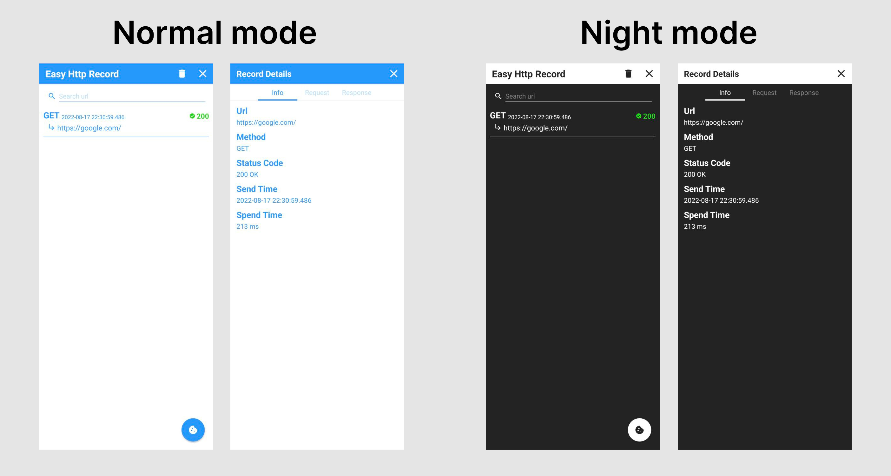
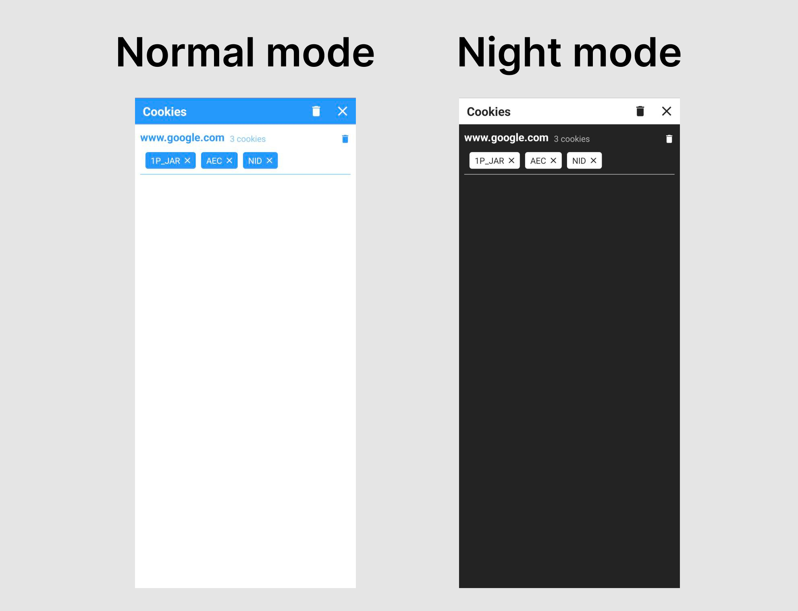

# Android Easy Http Library


## About Android Easy Http Library

* Made on [OkHttp](http://square.github.io/okhttp/).
* Easy to do http request, just make request and listen for the response.
* Visual http request record, make you debug easily.
* Http cookies persistence and editable.

## Using Library In Your Application

Add this in your app build.gradle file.

```groovy
android {
    buildFeatures {
        viewBinding true
        dataBinding true
    }
}

dependencies {
    implementation 'io.github.af19git5:easy-http-android:0.0.2'
}
```

Add permission in your AndroidManifest.xml

```xml
<uses-permission android:name="android.permission.INTERNET" />
```

And check your application minSdk must be greater than 24.

## Do Request

### GET Request

**Kotlin Example:**

```kotlin
EasyHttp.get(context, url)
  .build()
  .getAsString(object : StringResponseListener {
    override fun onSuccess(headers: Headers, body: String) {
      // Do something...
    }

    override fun onError(e: HttpException) {
      // Do something...
    }
  })
```

**Java Example:**

```java
EasyHttp.get(context, url)
  .build()
  .getAsString(new StringResponseListener() {
    @Override
    public void onSuccess(@NonNull Headers headers, @NonNull String body) {
      // Do something...
    }

    @Override
    public void onError(@NonNull HttpException e) {
      // Do something...
    }
  });
```

**Value Settings:**

* `.tag` - Add tag for request, can use in cancel request.
* `.addUrlParams` - Add url query param.
* `.urlParams` - Add url query params.
* `.addHeader` - Add header for request.
* `.headers` - Add headers for request.
* `.cacheable` - Cache response.
* `.saveRecord` - Do save http request record. Default value is true.
* `.connectTimeout` - Connect timeout time.
* `.readTimeout` - Read timeout time.
* `.readTimeout` - Read timeout time.

### Post Request

**Kotlin Example: **

```kotlin
EasyHttp.post(context, url)
  .jsonBody(obj)
  .build()
  .getAsString(object : StringResponseListener {
    override fun onSuccess(headers: Headers, body: String) {
      // Do something...
    }

    override fun onError(e: HttpException) {
      // Do something...
    }
  })
```

**Java Example:**

```java
EasyHttp.post(context, url)
  .jsonBody(obj)
  .build()
  .getAsString(new StringResponseListener() {
    @Override
    public void onSuccess(@NonNull Headers headers, @NonNull String body) {
      // Do something...
    }

    @Override
    public void onError(@NonNull HttpException e) {
      // Do something...
    }
  })
```

**Value Settings:**

Have the value settings in the get example.

* `.stringBody` - Set string request body, also can set your custom content type.
* `.jsonBody` - Set json object request body, also can set your custom content type.
* `.formBody` - Set form request body.
* `.requestBody` - Set your custom okhttp request body.

### Upload File

**Kotlin Example:**

```kotlin
EasyHttp.upload(context, url)
  .addMultipartFile("file", file)
  .addMultipartParameter("text", "text")
  .build()
  .getAsString(object : StringResponseListener {
    override fun onSuccess(headers: Headers, body: String) {
      // Do something...
    }

    override fun onError(e: HttpException) {
      // Do something...
    }
  })
```

**Java Example:**

```java
EasyHttp.upload(context, url)
  .addMultipartFile("file", file)
  .addMultipartParameter("text", "text")
  .build()
  .getAsString(new StringResponseListener() {
    @Override
    public void onSuccess(@NonNull Headers headers, @NonNull String body) {
      // Do something...
    }

    @Override
    public void onError(@NonNull HttpException e) {
      // Do something...
    }
  })
```

**Value Settings:**

Have the value settings in the get example.

* `.contentType` - Set upload request content type. Default value is "multipart/form-data".
* `.addMultipartParam` - Add multipart parameter.
* `.addMultipartFile` - Add multipart parameter. You can put `File`, `ByteArray`,  `Uri`.

### Cancel Request

**Kotlin Example:**

```kotlin
EasyHttp.cancel(tag)
```

**Java Example:**

```java
EasyHttp.cancel(tag);
```

### Custom OkHttpClient Builder

You can easily get OkHttpClient Builder and modify it.

**Kotlin Example:**

```kotlin
val easyHttpBuilder = EasyHttp.get(context, url)
val okHttpClientBuilder = easyHttpBuilder.okHttpClientBuilder

// Do something modify for OkHttpClient Builder...

easyHttpBuilder
  .build()
  .getAsString(object : StringResponseListener{
    override fun onSuccess(headers: Headers, body: String) {
      // Do something...
    }

    override fun onError(e: HttpException) {
      // Do something...
    }
  })
```

**Java Example:**

```java
RequestBuilder requestBuilder = EasyHttp.get(context, url);
OkHttpClient.Builder okHttpClientBuilder = requestBuilder.getOkHttpClientBuilder();

// Do something modify for OkHttpClient Builder...

requestBuilder.build().getAsString(new StringResponseListener() {
  @Override
  public void onSuccess(@NonNull Headers headers, @NonNull String body) {
	// Do something...
  }

  @Override
  public void onError(@NonNull HttpException e) {
	// Do something...
  }
});
```

## Response Listener

### Get response as String

**Kotlin Example:**

```kotlin
EasyHttp.get(context, url)
  .build()
  .getAsString(object : StringResponseListener {
    override fun onSuccess(headers: Headers, body: String) {
      // Do something...
    }

    override fun onError(e: HttpException) {
      // Do something...
    }
  })
```

**Java Example:**

```java
EasyHttp.get(context, url)
  .build()
  .getAsString(new StringResponseListener() {
    @Override
    public void onSuccess(@NonNull Headers headers, @NonNull String body) {
      // Do something...
    }

    @Override
    public void onError(@NonNull HttpException e) {
      // Do something...
    }
  });
```

### Get json response as custom object

**Kotlin Example:**

```kotlin
// Use class
EasyHttp.get(context, url)
  .build()
  .getJsonAsObject(CustomObj::class.java, object : JsonResponseListener<CustomObj> {
    override fun onSuccess(headers: Headers, body: CustomObj)  {
      // Do something...
    }

    override fun onError(e: HttpException) {
      // Do something...
    }
  })

// Use Gson TypeToken
EasyHttp.get(context, url)
  .build()
  .getJsonAsObject(
    object : TypeToken<CustomObj>() {},
    object : JsonResponseListener<CustomObj> {
      override fun onSuccess(headers: Headers, body: CustomObj) {
        // Do something...
      }

      override fun onError(e: HttpException) {
        // Do something...
      }
    })
```

**Java Example:**

```java
// Use class
EasyHttp.get(context, url)
  .build()
  .getJsonAsObject(
    CustomObj.class,
    new JsonResponseListener<>() {
      @Override
      public void onSuccess(@NonNull Headers headers, CustomObj body) {
        // Do something...
      }

      @Override
      public void onError(@NonNull HttpException e) {
        // Do something...
      }
  });

// Use Gson TypeToken
EasyHttp.get(context, url)
  .build()
  .getJsonAsObject(
    new TypeToken<String>() {},
    new JsonResponseListener<>() {
      @Override
      public void onSuccess(@NonNull Headers headers, CustomObj body) {
        // Do something...
      }

      @Override
      public void onError(@NonNull HttpException e) {
        // Do something...
      }
  });
```

### Download response

**Kotlin Example:**

```kotlin
EasyHttp.get(context, url)
  .build()
  .download(file, object : DownloadListener {
    override fun onSuccess(headers: Headers, file: File) {
      // Do something...
    }

    override fun onProgress(downloadBytes: Long, totalBytes: Long) {
      // Do something...
    }

    override fun onError(e: HttpException) {
      // Do something...
    }
  })
```

**Java Example:**

```java
EasyHttp.get(context, url)
  .build()
  .download(file, new DownloadListener() {
    @Override
    public void onSuccess(@NonNull Headers headers, @NonNull File file) {
       // Do something...
    }

    @Override
    public void onProgress(long downloadBytes, long totalBytes) {
      // Do something...
    }

    @Override
    public void onError(@NonNull HttpException e) {
      // Do something...
    }
  });
```

## Cookie Modify

### Clear cookies

**Kotlin Example:**

```kotlin
// clear all
EasyHttp.clearCookies(context)
// clear by host
EasyHttp.clearCookies(context, host)
// clear by host and cookie name
EasyHttp.clearCookies(context, host, name)
```

**Java Example:**

```java
// clear all
EasyHttp.clearCookies(context);
// clear by host
EasyHttp.clearCookies(context, host);
// clear by host and cookie name
EasyHttp.clearCookies(context, host, name);
```

## Android EasyHttp Page

### Http Record Page

If your request `saveRecord` is open, you can find record in the http record page.

**Preview:**



**Kotlin Example:**

```kotlin
EasyHttp.intentEasyHttpRecord(context)
```

**Java Example:**

```java
EasyHttp.intentEasyHttpRecord(context);
```

### Cookies Page

**Preview:**



**Kotlin Example:**

```kotlin
EasyHttp.intentEasyHttpCookies(context)
```

**Java Example:**

```java
EasyHttp.intentEasyHttpCookies(context);
```

## Demo app

[](https://play.google.com/store/apps/details?id=com.jimmyworks.easyhttpexample)

## License

```
Copyright 2022 Jimmy Kang

Licensed under the Apache License, Version 2.0 (the "License");
you may not use this file except in compliance with the License.
You may obtain a copy of the License at

  http://www.apache.org/licenses/LICENSE-2.0

Unless required by applicable law or agreed to in writing, software
distributed under the License is distributed on an "AS IS" BASIS,
WITHOUT WARRANTIES OR CONDITIONS OF ANY KIND, either express or implied.
See the License for the specific language governing permissions and
limitations under the License.
```
