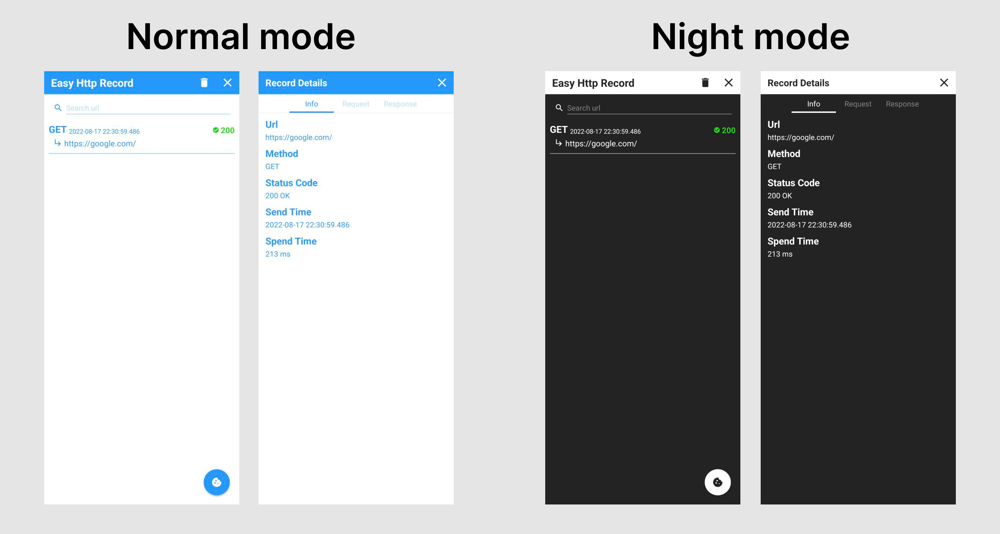

# Android Easy Http Library


## 關於Easy Http Library

* Http連線基底框架為 [OkHttp](http://square.github.io/okhttp/)進行開發。
* 簡化請求，只需覆寫回傳監聽。
* 可視覺化的傳輸紀錄，方便debug。
* Http cookies持久化，不需額外手動撰寫。

## 如何使用在自己專案

將以下代碼加入至專案中的 build.gradle。

```groovy
android {
    buildFeatures {
        viewBinding true
        dataBinding true
    }
}

dependencies {
    implementation 'io.github.af19git5:easy-http-android:0.0.3'
}
```

在專案中的AndroidManifest.xml加入網路權限。

```xml
<uses-permission android:name="android.permission.INTERNET" />
```

確認自己專案的minSdk必須大於24。

## 執行請求

### GET Request

**Kotlin範例:**

```kotlin
EasyHttp.get(context, url)
  .build()
  .getAsString(object : StringResponseListener {
    override fun onSuccess(headers: Headers, body: String) {
      // Do something...
    }

    override fun onError(e: HttpException) {
      // Do something...
    }
  })
```

**Java範例:**

```java
EasyHttp.get(context, url)
  .build()
  .getAsString(new StringResponseListener() {
    @Override
    public void onSuccess(@NonNull Headers headers, @NonNull String body) {
      // Do something...
    }

    @Override
    public void onError(@NonNull HttpException e) {
      // Do something...
    }
  });
```

**可設定參數:**

* `.tag` - 將請求增加tag，可用來取消請求用。
* `.addUrlParams` - 增加url查詢參數。
* `.urlParams` - 設定url查詢參數。
* `.addHeader` - 增加header。
* `.headers` - 設定headers。
* `.cacheable` - 結果是否加入快取。
* `.saveRecord` - 是否要寫入傳輸紀錄，預設為true。
* `.connectTimeout` - 連線超時最大時長。
* `.readTimeout` - 讀取超時最大時長。
* `.writeTimeout` - 寫入超時最大時長。

### Post Request

**Kotlin範例:**

```kotlin
EasyHttp.post(context, url)
  .jsonBody(obj)
  .build()
  .getAsString(object : StringResponseListener {
    override fun onSuccess(headers: Headers, body: String) {
      // Do something...
    }

    override fun onError(e: HttpException) {
      // Do something...
    }
  })
```

**Java範例:**

```java
EasyHttp.post(context, url)
  .jsonBody(obj)
  .build()
  .getAsString(new StringResponseListener() {
    @Override
    public void onSuccess(@NonNull Headers headers, @NonNull String body) {
      // Do something...
    }

    @Override
    public void onError(@NonNull HttpException e) {
      // Do something...
    }
  })
```

**可設定參數:**

擁有上面Get request可設定參數，及下列可設定參數。

* `.stringBody` - 設定字串request body，也可客製化選擇想傳輸的content-type。
* `.jsonBody` - 設定json物件request body，也可客製化選擇想傳輸的content-type。
* `.formBody` - 設定form request body。
* `.requestBody` - 設定自己客製化的okhttp request body。

### 上傳檔案

**Kotlin範例:**

```kotlin
EasyHttp.upload(context, url)
  .addMultipartFile("file", file)
  .addMultipartParameter("text", "text")
  .build()
  .getAsString(object : StringResponseListener {
    override fun onSuccess(headers: Headers, body: String) {
      // Do something...
    }

    override fun onError(e: HttpException) {
      // Do something...
    }
  })
```

**Java範例:**

```java
EasyHttp.upload(context, url)
  .addMultipartFile("file", file)
  .addMultipartParameter("text", "text")
  .build()
  .getAsString(new StringResponseListener() {
    @Override
    public void onSuccess(@NonNull Headers headers, @NonNull String body) {
      // Do something...
    }

    @Override
    public void onError(@NonNull HttpException e) {
      // Do something...
    }
  })
```

**可設定參數:**

擁有上面Get request可設定參數，及下列可設定參數。

* `.contentType` - 設定content-type，預設值為 "multipart/form-data"。
* `.addMultipartParam` - 增加multipart參數.
* `.addMultipartFile` - 增加multipart檔案參數，可放置 `File`, `ByteArray`,  `Uri`.

### 取消 Request

**Kotlin範例:**

```kotlin
EasyHttp.cancel(tag)
```

**Java範例:**

```java
EasyHttp.cancel(tag);
```

### 客製化 OkHttpClient Builder

您可以很簡單取得傳輸使用的OkHttpClient Builder，並且客製化為您的需求。

**Kotlin範例:**

```kotlin
val easyHttpBuilder = EasyHttp.get(context, url)
val okHttpClientBuilder = easyHttpBuilder.okHttpClientBuilder

// Do something modify for OkHttpClient Builder...

easyHttpBuilder
  .build()
  .getAsString(object : StringResponseListener{
    override fun onSuccess(headers: Headers, body: String) {
      // Do something...
    }

    override fun onError(e: HttpException) {
      // Do something...
    }
  })
```

**Java範例:**

```java
RequestBuilder requestBuilder = EasyHttp.get(context, url);
OkHttpClient.Builder okHttpClientBuilder = requestBuilder.getOkHttpClientBuilder();

// Do something modify for OkHttpClient Builder...

requestBuilder.build().getAsString(new StringResponseListener() {
  @Override
  public void onSuccess(@NonNull Headers headers, @NonNull String body) {
	// Do something...
  }

  @Override
  public void onError(@NonNull HttpException e) {
	// Do something...
  }
});
```

## Response 監聽器

### 取得字串Response

**Kotlin範例:**

```kotlin
EasyHttp.get(context, url)
  .build()
  .getAsString(object : StringResponseListener {
    override fun onSuccess(headers: Headers, body: String) {
      // Do something...
    }

    override fun onError(e: HttpException) {
      // Do something...
    }
  })
```

**Java範例:**

```java
EasyHttp.get(context, url)
  .build()
  .getAsString(new StringResponseListener() {
    @Override
    public void onSuccess(@NonNull Headers headers, @NonNull String body) {
      // Do something...
    }

    @Override
    public void onError(@NonNull HttpException e) {
      // Do something...
    }
  });
```

### 取得Json Response並轉為客製化的物件

**Kotlin範例:**

```kotlin
// Use class
EasyHttp.get(context, url)
  .build()
  .getJsonAsObject(CustomObj::class.java, object : JsonResponseListener<CustomObj> {
    override fun onSuccess(headers: Headers, body: CustomObj)  {
      // Do something...
    }

    override fun onError(e: HttpException) {
      // Do something...
    }
  })

// Use Gson TypeToken
EasyHttp.get(context, url)
  .build()
  .getJsonAsObject(
    object : TypeToken<CustomObj>() {},
    object : JsonResponseListener<CustomObj> {
      override fun onSuccess(headers: Headers, body: CustomObj) {
        // Do something...
      }

      override fun onError(e: HttpException) {
        // Do something...
      }
    })
```

**Java範例:**

```java
// Use class
EasyHttp.get(context, url)
  .build()
  .getJsonAsObject(
    CustomObj.class,
    new JsonResponseListener<>() {
      @Override
      public void onSuccess(@NonNull Headers headers, CustomObj body) {
        // Do something...
      }

      @Override
      public void onError(@NonNull HttpException e) {
        // Do something...
      }
  });

// Use Gson TypeToken
EasyHttp.get(context, url)
  .build()
  .getJsonAsObject(
    new TypeToken<String>() {},
    new JsonResponseListener<>() {
      @Override
      public void onSuccess(@NonNull Headers headers, CustomObj body) {
        // Do something...
      }

      @Override
      public void onError(@NonNull HttpException e) {
        // Do something...
      }
  });
```

### 下載Response

**Kotlin範例:**

```kotlin
EasyHttp.get(context, url)
  .build()
  .download(file, object : DownloadListener {
    override fun onSuccess(headers: Headers, file: File) {
      // Do something...
    }

    override fun onProgress(downloadBytes: Long, totalBytes: Long) {
      // Do something...
    }

    override fun onError(e: HttpException) {
      // Do something...
    }
  })
```

**Java範例:**

```java
EasyHttp.get(context, url)
  .build()
  .download(file, new DownloadListener() {
    @Override
    public void onSuccess(@NonNull Headers headers, @NonNull File file) {
       // Do something...
    }

    @Override
    public void onProgress(long downloadBytes, long totalBytes) {
      // Do something...
    }

    @Override
    public void onError(@NonNull HttpException e) {
      // Do something...
    }
  });
```

## Cookie異動

### 清理Cookies

**Kotlin範例:**

```kotlin
// clear all
EasyHttp.clearCookies(context)
// clear by host
EasyHttp.clearCookies(context, host)
// clear by host and cookie name
EasyHttp.clearCookies(context, host, name)
```

**Java範例:**

```java
// clear all
EasyHttp.clearCookies(context);
// clear by host
EasyHttp.clearCookies(context, host);
// clear by host and cookie name
EasyHttp.clearCookies(context, host, name);
```

## Android EasyHttp頁面

### Http傳輸紀錄頁面

在這頁面會紀錄您使用EasyHttp的紀錄。

如果您的請求中的 `saveRecord`是開啟的，您可以在這頁中找到您的傳輸紀錄。

**畫面預覽:**



您可以使用下面的代碼跳轉至本頁面。

**Kotlin範例:**

```kotlin
EasyHttp.intentEasyHttpRecord(context)
```

**Java範例:**

```java
EasyHttp.intentEasyHttpRecord(context);
```

### Cookies頁面

在這頁面會顯示EasyHttp持久化的cookies。

您也可以在這頁面進行異動cookies。

**畫面預覽:**


您可以使用下面的代碼跳轉至本頁面。

**Kotlin範例:**

```kotlin
EasyHttp.intentEasyHttpCookies(context)
```

**Java範例:**

```java
EasyHttp.intentEasyHttpCookies(context);
```

## 範例App

[](https://play.google.com/store/apps/details?id=com.jimmyworks.easyhttpexample)

## License

```
Copyright 2022 Jimmy Kang

Licensed under the Apache License, Version 2.0 (the "License");
you may not use this file except in compliance with the License.
You may obtain a copy of the License at

  http://www.apache.org/licenses/LICENSE-2.0

Unless required by applicable law or agreed to in writing, software
distributed under the License is distributed on an "AS IS" BASIS,
WITHOUT WARRANTIES OR CONDITIONS OF ANY KIND, either express or implied.
See the License for the specific language governing permissions and
limitations under the License.
```
